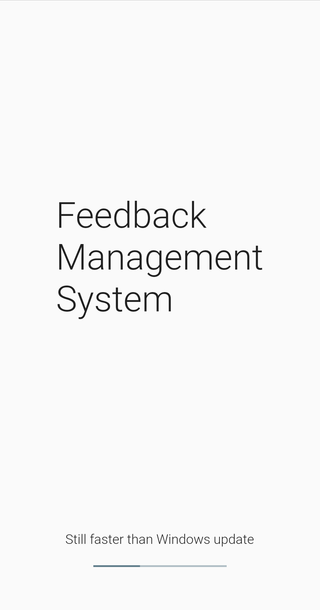
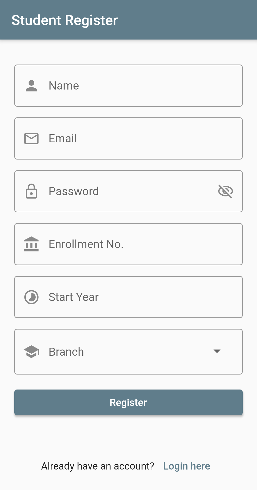
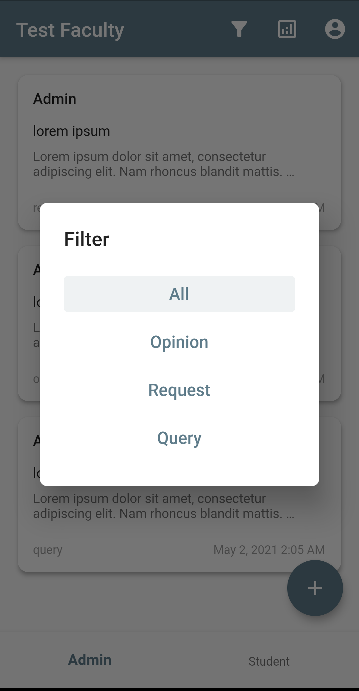
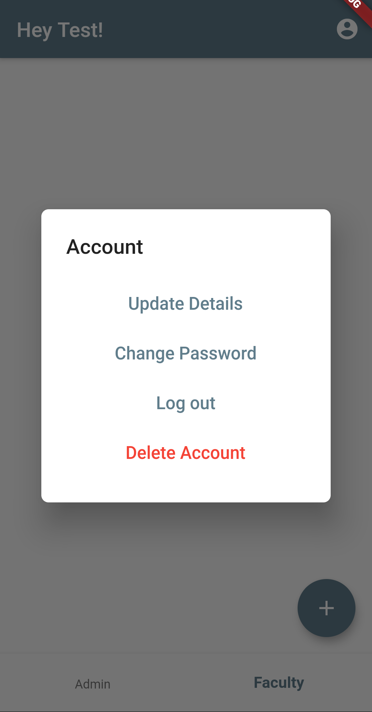
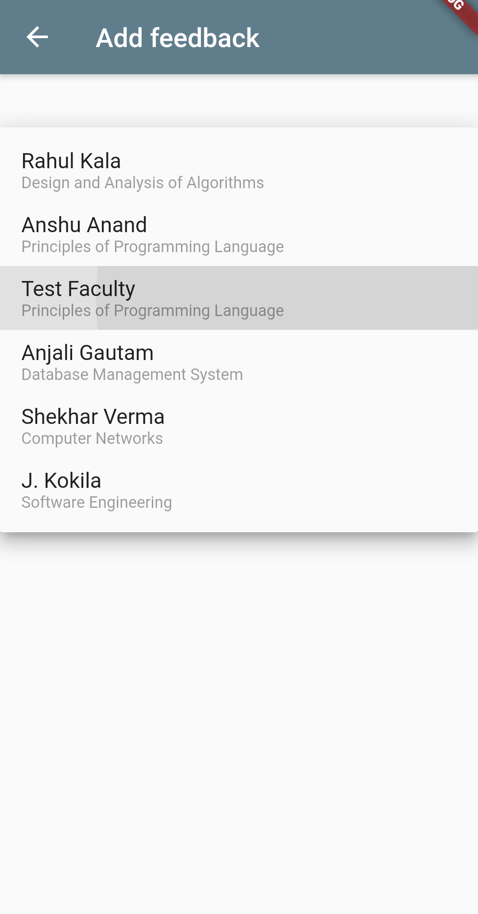
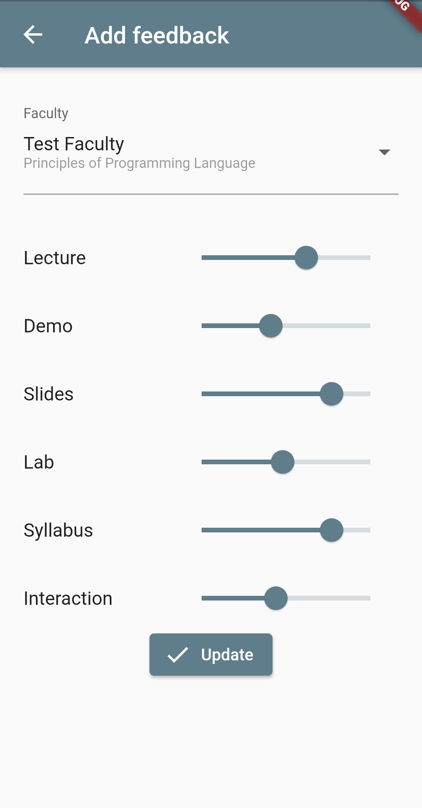
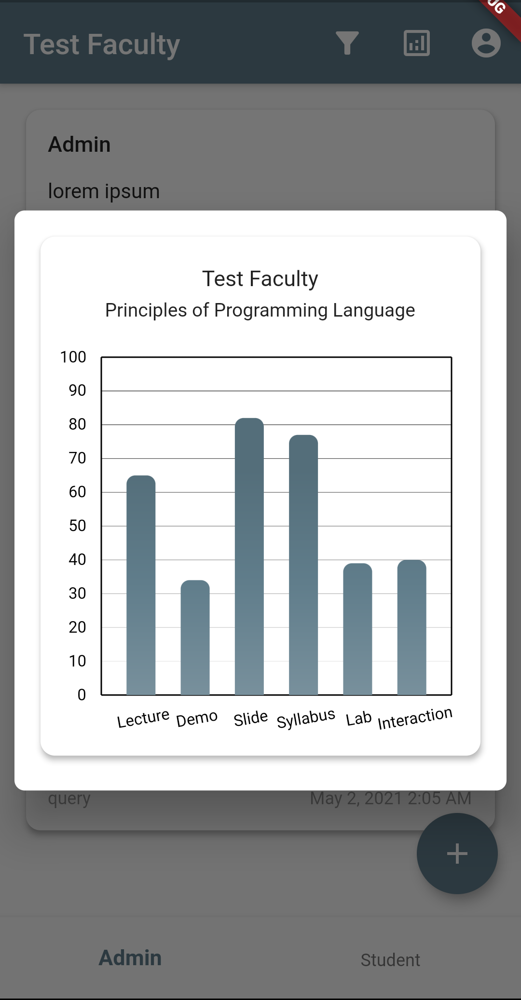
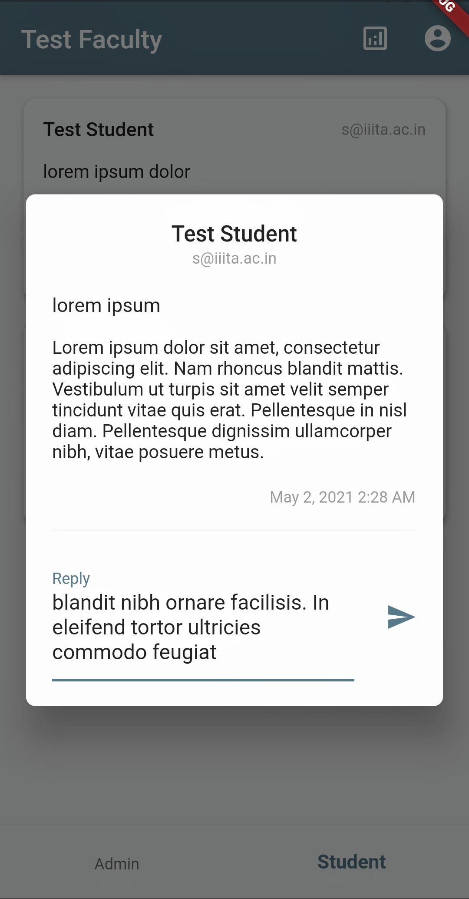

# Feedback Management System

A Simple Feedback Management System made for IIITA.  
It considers 3 types of user profiles: Student, Faculty, Admin.  
Students and Faculty can send a query, request or an opinion to Admin.  
Students can give Faculty a rating based on teaching performance and overall experience.  
Admins and Faculties can reply back.  
  
#### [ER Diagram](misc/ER_Diagram.pdf)
<br>


## Technology Used

 - Flutter
 - PostgreSQL (database stored on Heroku)
<br><br>


## Getting Started

```
git clone https://github.com/AkshatBaranwal/feedback.git
cd feedback
flutter run
```
<br><br>


## Screenshots
<p>
  
  
  
  
  
  
  
  
  
  
  
  
</p>